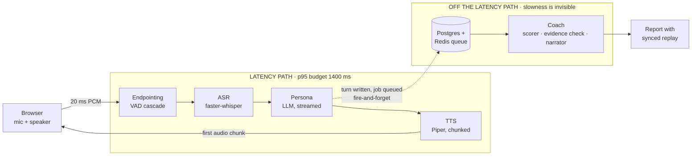

# InteractAI

**Rehearse a hard interview out loud: an AI interviewer answers you by voice, in character, and a
separate coach scores every answer against a rubric, citing the exact words each score rests on.**

> **Demo video:** not yet recorded; the script is in [`docs/DEMO-VIDEO-SCRIPT.md`](docs/DEMO-VIDEO-SCRIPT.md).
> Until then, [`/demo`](apps/web/app/demo/page.tsx) is a 60-second guided walkthrough of a real
> recorded session that runs with every backend service switched off.

InteractAI measures performance against a rubric the scenario author wrote. **It does not predict
hiring outcomes**, and neither the product nor this README claims otherwise.

---

## The two agents



The persona must answer fast, so it is the only model on the latency path. The coach never touches
that path: scoring is queued and can take as long as it needs. Scores come from the scorer; prose
comes from a narrator that is given the fixed scores and may not contradict them. An evidence
span that is not a verbatim substring of the transcript is discarded, and below the confidence
threshold the UI shows *not enough signal*, never a number.

---

## Published metrics

Every figure below comes from an `eval_runs` row (or, for latency, `latency_events`) and carries
its dataset revision, model version, host and date. Anything not measured says so.

### Latency: end of speech → first audible word

| p50 | p90 | p95 | n | Target | Host | Source |
|---|---|---|---|---|---|---|
| 3,576 ms | 4,774 ms | 5,936 ms | 8 turns | p95 ≤ 1,400 ms | `dev-laptop-cpu` | eval_runs `01a0ac1e` (speech suite), 2026-09-16 UTC |

**The budget is not met on this host.** It is a CPU-only laptop running Whisper, a hosted persona
model and Piper in one process. The stage breakdown for the same turns puts ASR finalisation
(~1.3–1.7 s) and the fixed endpointing silence (~750 ms) ahead of model TTFT (~600–700 ms) and first
TTS chunk (~240 ms). n = 8 is small: these are the turns recorded on this host after host tagging
existed. No GPU or hosted-instance measurement exists yet.

### Scorer agreement with humans

| Scorer QWK | Human ceiling (two annotators) | Source |
|---|---|---|
| not yet measured | not yet measured | — |

No human-labelled test split exists yet, and none was invented to fill this row (see
[docs/decisions/0027](docs/decisions/0027-phase6-no-fabricated-agreement.md)).
[docs/PHASE5-WALKTHROUGH.md](docs/PHASE5-WALKTHROUGH.md) is the path to a real number.

### Speech components (Level 1)

eval_runs `01a0ac1e`, dataset revision `66429d7de3`, `asr=base.en;tts=en_US-lessac-medium`,
`dev-laptop-cpu`, 2026-09-16 UTC. **Passed** (the RTF gates).

| WER overall | WER clean | WER accented | WER technical | ASR RTF | TTS RTF | Endpoint precision | Endpoint recall | Endpoint latency p50 / p95 |
|---|---|---|---|---|---|---|---|---|
| 0.052 | 0.000 | 0.000 | 0.156 | 0.13 | 0.11 | 0.573 | 1.000 | 507 / 596 ms |

Every fixture is Piper TTS, not recorded human speech; "accented" means a British English Piper
voice. Treat these as regression tripwires, not as claims about real users.

### Persona adherence (Level 2)

eval_runs `01a0aca9`, dataset revision `d29a7849f0` (candidate scripts v1.0.0 + judge prompt
v1.0.0), persona **`ollama/qwen2.5:3b-instruct`** (the local model), judge `groq/openai/gpt-oss-120b`,
5 sessions × 3 tiers × 4 answers, 2026-09-16 UTC. **Failed**, and it should have.

| Character breaks | Repetitions (cos ≥ 0.92) | Plan adherence | Reply length mean / p50 / p95 | Canned deflections |
|---|---|---|---|---|
| **0.05** (3 of 60) | 9 pairs | 1.00 ¹ | 24.6 / 20 / 63 words | 4 of 60 |

| Difficulty separation (gentle vs hard, one-sided Mann-Whitney) | gentle | standard | hard | p | Separated? |
|---|---|---|---|---|---|
| Follow-up rate after a vague answer | 0.50 | 0.80 | 0.90 | 0.042 | yes |
| Acknowledgement words before the question | 13.0 | 10.4 | 7.3 | 0.298 | **no** |
| Interruptions of a >120-word ramble | 0.2 | 0.0 | 0.0 | 0.885 | **no** |

All three breaks are praise, for example *"Sure, that's impressive. Can you tell me more about…"*.
The post-generation blocklist catches coaching and grading phrases but not praise. The ladder is
real for follow-ups and decorative for interruptions: nothing in realtime enforces
`interrupt_over_words`, and the model does not do it on its own.

**The test was tested:** the same suite with a deliberately broken static prompt (praise and grade
every answer) measured a break rate of **0.75** (9 of 12, eval_runs `01a0acaf`).

**Not measured against the hosted persona (`groq/openai/gpt-oss-20b`) today.** That run (eval_runs
`01a0ac90`) exhausted Groq's free-tier daily token quota partway through, so 55 of its 60 replies
were the engine's canned deflections. It measures a rate limit, not the persona, and is not
published. For the same reason, 3 of the 18 hosted-model live safety cases (the distress exits)
failed while the quota was exhausted; all 18 local-model cases passed.

¹ The planner also runs on the quota-exhausted hosted model, so every session used the fallback
plan derived from the opening strategy. 1.00 is adherence to that fallback, not to a generated plan.

---

## Results table (scorer ablation ladder)

From [docs/RESULTS.md](docs/RESULTS.md). All eight rows are defined and the harness runs them;
none has a human-labelled test split to be measured against yet.

| # | Configuration | QWK | MAE | Spearman | Adj. acc | ECE | Cost / session | Latency |
|---|---|---|---|---|---|---|---|---|
| — | Human ceiling (2 annotators) | not yet measured | | | | | | |
| 1 | Majority class | not yet measured | | | | | | |
| 2 | Deterministic features + ridge | not yet measured | | | | | | |
| 3 | Frontier zero-shot | not yet measured | | | | | | |
| 4 | Frontier few-shot (**shipping baseline**) | not yet measured | | | | | | |
| 5 | Fine-tuned encoder, 1 seed | not yet measured | | | | | | |
| 6 | Fine-tuned encoder, 3-seed ensemble | not yet measured | | | | | | |
| 7 | + isotonic calibration | not yet measured | | | | | | |
| 8 | LoRA 1.5B (not shipped) | not yet measured | | | | | | |

---

## Where it is weakest: real failure cases

All from the `/demo` session (`01a0ac0d-a66e-7f53-ba73-bd2dec3b19fd`, scorer
`prompted:groq/openai/gpt-oss-20b:1.0.0`, 2026-09-16) and the Level 1 run above. None was cherry-picked
to look good.

1. **Relevance scored 1/5 on the best answer in the session.** The persona asked about pushing back
   on a decision; the candidate answered *"Okay, specifically. Checkout was timing out. I profiled
   it, found one unindexed query, added the index, and P95 dropped from 2 seconds to 300
   milliseconds."* The scorer read it as off-topic because it never names the disagreement. A human
   would likely score it relevant-but-incomplete. The evidence span is the whole answer, so the
   report shows the right words but draws the wrong conclusion from them.
2. **Concision scored 5/5 on the vaguest answer.** *"I guess there was a project where people didn't
   agree. We talked about it a lot and it sort of worked out."* It is short, and the scorer rewarded
   brevity without content. Concision and specificity interact, and the prompted baseline does not
   model that.
3. **Two of four answers got no rubric scores at all** (confidence 0 on every criterion). They
   correctly show *not enough signal*, but that includes the rambling answer, which is exactly where a
   candidate most needs feedback. Abstention is safe; it is not yet useful.
4. **ASR on technical vocabulary.** *"We sharded the Postgres cluster, put Redis in front of it"* came
   back as *"We sharded the poster's cluster, puttritis in front of it"*. WER 0.20 on that clip.
   Anything scored downstream inherits the error.
5. **The persona sometimes reaches for a canned line.** After the strongest answer, the interviewer
   said *"Let's keep going — what's your answer?"*. That is a deflection substituted when the
   generated reply fails the post-generation check or comes back empty, and here it reads as not
   having listened.

---

## Architecture, briefly

| Service | What it is | Spec |
|---|---|---|
| `apps/web` | Next.js App Router: practice room, report and replay, dashboard, `/demo`, admin observability and evaluations | [phase-3](docs/phase-3-BUILD%20(1).md), [phase-6](docs/phase-6-BUILD%20(1).md) |
| `services/realtime` | Stateful WebSocket service: VAD, endpointing cascade, streaming ASR, persona, chunked TTS, state machine with a degraded state | [03-realtime-protocol](docs/03-realtime-protocol.md), [phase-1](docs/phase-1-BUILD%20(1).md), [phase-2](docs/phase-2-BUILD%20(1).md) |
| `services/api` | Stateless FastAPI: auth, sessions, reports, admin | [phase-0](docs/phase-0-BUILD%20(1).md) |
| `services/coach` | ARQ worker: scorer, evidence verification, narrator, report | [phase-2](docs/phase-2-BUILD%20(1).md) |
| `services/training` | Dataset builder, annotation, fine-tune and eval harness (not deployed) | [phase-5](docs/phase-5-BUILD%20(1).md), [walkthrough](docs/PHASE5-WALKTHROUGH.md) |

Every pipeline stage writes a `latency_events` row and every model call a `model_calls` row, with no
sampling. Deployment and the stateful rules for `realtime` (session affinity, capacity cap,
readiness vs liveness, SIGTERM drain) are in [docs/18-deployment.md](docs/18-deployment.md). Design
decisions that turned out differently from the spec are in [docs/decisions/](docs/decisions/).

---

## Self-host

```bash
git clone https://github.com/GH-BCooper/INTERACTAI.git && cd INTERACTAI
docker compose -f compose.selfhost.yml up --build
# http://localhost:3000 → Sign in → "Continue locally"
```

No external API keys: Ollama runs the persona and coach models; faster-whisper and Piper run inside
`realtime`; Postgres, Redis and MinIO are local. First boot downloads model weights (~2.5 GB) into
volumes. Verified from a clean clone on 2026-09-17. On a CPU-only laptop the 3B local persona model
is too slow to answer inside the turn watchdog, so replies degrade to a holding line; use a GPU or
a smaller `MODEL_PERSONA` ([docs/18-deployment.md](docs/18-deployment.md#self-host-as-12)).

For development (hot reload, hosted models): copy `.env.example` to `.env`, then
`make up && make migrate && make seed`, and run `make api`, `make realtime`, `make coach` and
`make web` in separate terminals. `make test`, `make lint`, `make eval-speech`, `make eval-persona`
and `make eval` are the checks.

---

## Roadmap

The v1 loop (speak, be answered convincingly and fast, be scored defensibly) is built. What
follows is the P1/P2 catalogue from the build plan, grouped by what it would add. None of it is
started, and the explicit anti-scope in `CLAUDE.md §9` (full-duplex barge-in, video analysis,
multilingual, native mobile, panel interviews, proctoring or certification) stays out.

**Make the numbers real (next).** Recruited, consented sessions and a second human annotator for a
published QWK beside its human ceiling; the fine-tuned scorer promoted only if every seed beats the
baseline; a hosted deployment with its own `HOST_CLASS` latency; human-voiced fixtures for the
speech suite.

**P1: product complete.** Share and export for reports; deleting a single recording from the
report; user-authored scenarios with content-boundary review; resume-aware question plans;
progress trends per criterion; notification preferences that actually send.

**P2: stretch.** Negotiation and behavioural packs beyond the seeded nine scenarios; a GPU realtime
tier aimed at the 1400 ms p95; a thinner model client to bring the `coach` and `realtime` images under
their size targets ([decision 0026](docs/decisions/0026-phase6-image-size-targets-missed.md));
embedding-based repetition thresholds calibrated against labelled pairs.

---

## Safety and privacy

- **Distress (AS-07).** The persona distinguishes a candidate struggling with a question from a
  person in real distress. On genuine ambiguity it breaks character downward into care, ends the
  session, and surfaces support resources; that session gets no scored report. This lives in the
  static prompt layer and is covered by the live safety suite (`tests/safety`, run in CI).
- **Content boundaries (AS-08).** The persona refuses to enact harassment or discriminatory
  questioning, even when a scenario asks for it, and offers a legitimate hard-interview alternative.
- **Prompt injection (AS-09).** Candidate speech is delimited and labelled as untrusted; the rubric is
  never disclosed under any framing; a post-generation check blocks criterion names, coaching
  phrases and prompt fragments; injection cases run in CI.
- **PII scrubbing: honest limitations.** Transcripts are scrubbed before any human annotator sees
  them, using spaCy named-entity recognition plus pattern rules for emails, phone numbers and salary
  figures.
  **It misses things**: names that spaCy's small English model does not tag (uncommon or
  non-Western names, lower-case transcription), employers mentioned as ordinary nouns, and
  identifying details that are not entities at all ("the only woman on the payments team").
  Annotators are instructed accordingly; do not treat scrubbed text as anonymous.
- **Retention and consent.** Audio expires after 30 days by default. Persona audio is never stored:
  it is regenerated from transcript + voice id. (The one exception is the static `/demo` asset;
  see [decision 0024](docs/decisions/0024-phase6-demo-recording-provenance.md).) Training consent is
  separate, explicit and revocable, and deletion removes object storage too.
